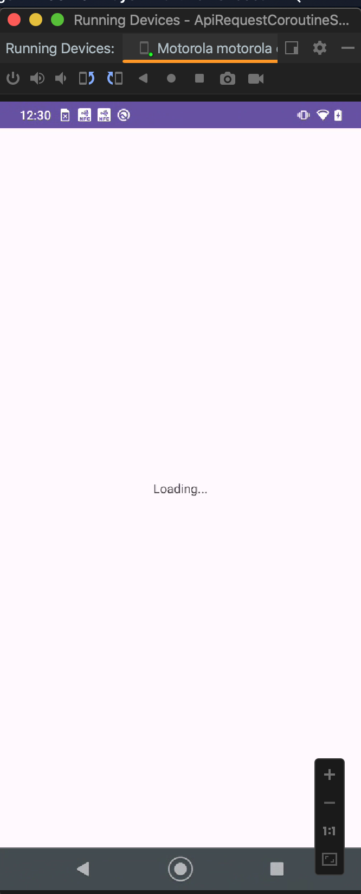
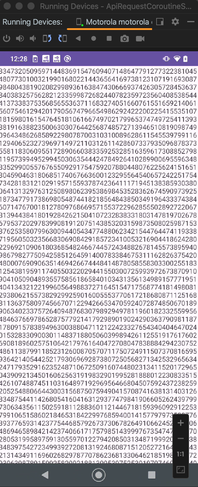

# ApiRequestCoroutineSample
## An Android App Sample of how to use coroutines the fetch Api rest and do order long operations

* Kotlin
* Http requests
* Coroutines (launch, async, await, defered, withContext, dispatchers.IO/Default)

 

## Reference
* https://amitshekhar.me/blog/kotlin-coroutines